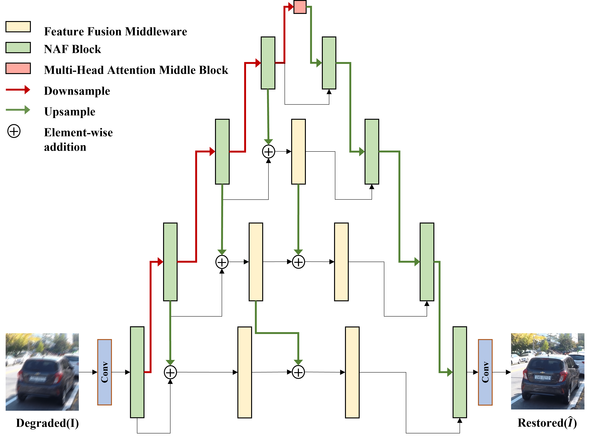
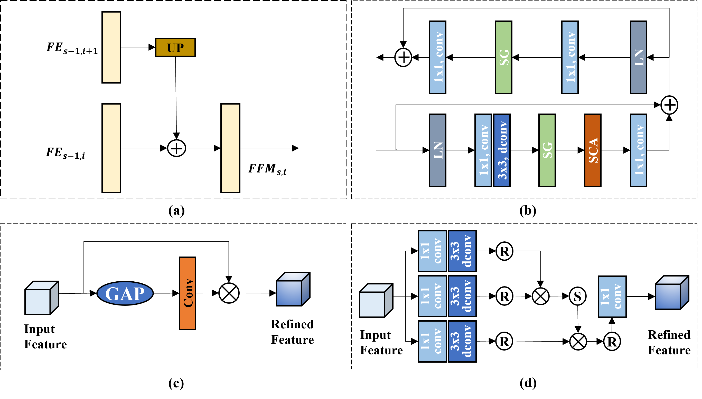

# A Mountain Shaped Single-Stage Network for Image Restoration

<!-- [](http://arxiv.org/abs/2302.09554) -->
<hr />


> **Abstract:** * Image restoration is the task of aiming to obtain the high quality image from a corrupt input image, such as deblurring and
deraining. In the process of image restoration, it is typically necessary to maintain a complex balance between spatial details and
contextual information. Although multi-stage network can optimally
balance these competing goals and achieve significant performance,
this also increases the complexity of the system. In this paper, we
propose a mountain shaped single-stage design base on a simple UNet architecture, which removes or replaces unnecessary nonlinear
activation functions to achieve the above balance with low system
complexity. Specifically, we propose a feature fusion middleware
(FFM) mechanism as an information exchange component between
the encoder-decoder architectural levels. It seamlessly integrates upper layer information into the adjacent lower layer, proceeding sequentially down to the lowest layer. Finally, all information is fused
into the original image resolution manipulation level. This preserves
spatial details and integrates contextual information, ensuring high quality image restoration. In addition, we propose a multi-head attention middle block (MHAMB) as a bridge between the encoder and
decoder to capture more global information and surpass the limitations of the receptive field of CNNs. Extensive experiments demonstrate that our approach, named as M3SNet, outperforms previous
state-of-the-art models while using less than half the computational
costs, for several image restoration tasks, such as image deraining
and deblurring.* 

## Network Architecture
<table>
  <tr>
    <td align="center">  </td>
  </tr>
  <tr>
    <td><p align="center"><b>Overall Framework of M3SNet</b></p></td>
  </tr>
    <tr>
    <td align="center">  </td>
  </tr>
  <tr>
    <td><p align="center"><b>(a) Feature fusion midddleware (FFM) that enables the exchange of information across multiple scales while preserving the fine details. (b) The architecture of nonlinear activation free block (NAFBlock). (c) Simplified Channel Attention (SCA). (d) Multi-head attention middle block (MHAMB) that  capture more global information.</b></p></td>
</table>

## Our code will be released after the paper is published

## Installation
The model is built in PyTorch 1.1.0 and tested on Ubuntu 16.04 environment (Python3.7, CUDA9.0, cuDNN7.5).

For installing, follow these intructions
```
conda create -n pytorch1 python=3.7
conda activate pytorch1
conda install pytorch=1.1 torchvision=0.3 cudatoolkit=9.0 -c pytorch
pip install matplotlib scikit-image opencv-python yacs joblib natsort h5py tqdm
```

Install warmup scheduler

```
cd pytorch-gradual-warmup-lr; python setup.py install; cd ..
```

## Quick Run

To test the pre-trained models of [pre-trained](https://drive.google.com/drive/folders/1y4BEX7LagtXVO98ZItSbJJl7WWM3gnbD?usp=share_link)


## Training and Evaluation

Training and Testing codes for deblurring and deraining  are provided in their respective directories.

## Results


<details>
  <summary> <strong>Result</strong> (click to expand) </summary>
<table>
  <tr>
    <td>  </td>
  </tr>
</table></details>


## Citations
If our code helps your research or work, please consider citing our paper.
The following is a BibTeX reference:

```
@article{Gao2023AMS,
  title={A Mountain-Shaped Single-Stage Network for Accurate Image Restoration},
  author={Hu Gao and Jing Yang and Ying Zhang and Ning Wang and Jingfan Yang and Depeng Dang},
  journal={arXiv preprint arXiv:2305.05146},
  year={2023}
}
```


## Contact
Should you have any question, please contact two_bits@163.com

